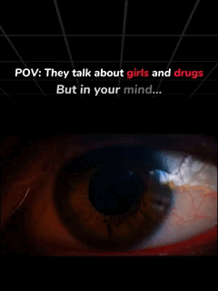
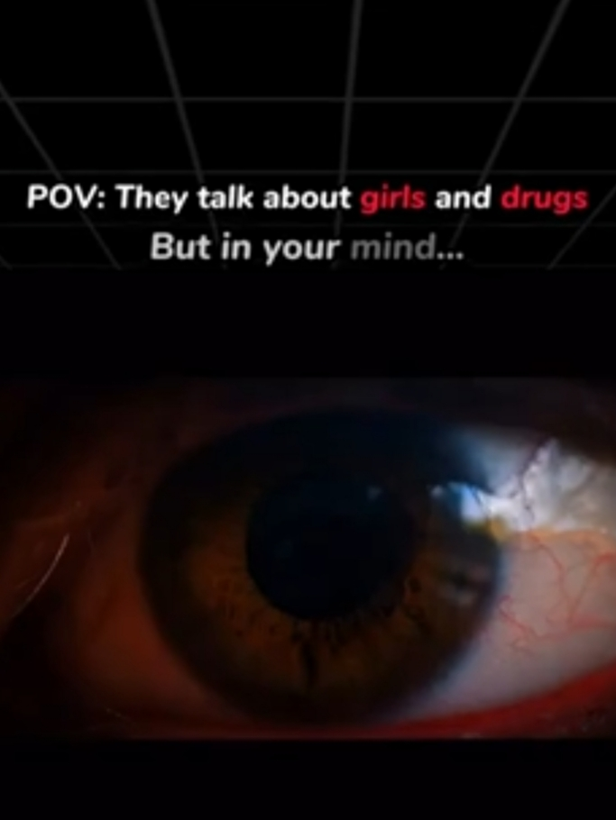

 

<!---->
<!---->

   

  
  

<!--
 

<a href="https://www.linkedin.com/in/aashoosharma">
<a href="https://aashoosharma.netlify.app">

-->

 

  

════════ ♢.✰.♢ ════════

 

 

<h1 align="center" > 𝗔𝗕𝗢𝗨𝗧 𝗠𝗘 </h1>

  

<!--

  

-->
<!--
I’m a 𝘽.𝙏𝙚𝙘𝙝 𝘾𝙎𝙀 2𝙣𝙙-𝙮𝙚𝙖𝙧 (4𝙩𝙝 𝙨𝙚𝙢𝙚𝙨𝙩𝙚𝙧) student at 𝗣𝗼𝗼𝗿𝗻𝗶𝗺𝗮 𝗖𝗼𝗹𝗹𝗲𝗴𝗲, passionate about building 𝗶𝗻𝗻𝗼𝘃𝗮𝘁𝗶𝘃𝗲 𝘀𝗼𝗹𝘂𝘁𝗶𝗼𝗻𝘀 in 𝘾𝙮𝙗𝙚𝙧𝙨𝙚𝙘𝙪𝙧𝙞𝙩𝙮, 𝘿𝙚𝙫𝙊𝙥𝙨, 𝙄𝙤𝙏, 𝙋𝙮𝙩𝙝𝙤𝙣, 𝙖𝙣𝙙 𝘼𝙄. My journey includes solid 𝘁𝗲𝗰𝗵𝗻𝗶𝗰𝗮𝗹 𝘀𝗸𝗶𝗹𝗹𝘀 and 𝗺𝗲𝗻𝘁𝗼𝗿𝗶𝗻𝗴 experience.
-->

════════ ♢.✰.♢ ════════

<!--<h3 align="center">devOps Engineer</h3>-->

  

  

  

  

---

### 🚀 Languages & Tools

</dive>

  
  
  
  
  
  
  
  
  
  
  
  

---

## ⚙️ Tech Stack Summary

  
  

---

## 📈 GitHub Stats & Activity

  
  

  

---

## 🌟 Highlights & Timeline

  
  
  

---

  🚀 Let's connect, collaborate, and conquer the future together!

---
  

  
💬 When someone asks about my girlfriend...

   

  🧠 My mind is constantly engaged with technology ⚙️💻, sci-fi 🚀✨, mysteries 🔍🧩, and alternate universes 🌌🪐.

    

  

<!---
- 👋 Hi, I’m @AashooSharma
- 👀 I’m interested in Cybersecurity, DevOps, IoT, AI, ML
- 🌱 Currently learning full-stack & AI
- 💞️ Always up for collaboration on exciting futuristic tech
- 📫 Reach me at: aashoosharma8290@gmail.com
--->

<!--    

&nbsp;

### Languages and Tools:

 
 

## ⚙️ Technology Stack  

  
  

---

## 📊 GitHub Stats  

  
  

---

## 🔥 Contribution Graph  

  

---

## 🔍 Activity Overview  

  
  
  

---

*   Shows user rank percentile instead of rank level

<!---
- 👋 Hi, I’m @AashooSharma
- 👀 I’m interested in ...
- 🌱 I’m currently learning ...
- 💞️ I’m looking to collaborate on ...
- 📫 How to reach me ...
--->

<!---
AashooSharma/AashooSharma is a ✨ special ✨ repository because its `README.md` (this file) appears on your GitHub profile.
You can click the Preview link to take a look at your changes.
--->
